# SupBuddy Frontend - Architecture Overview

## System Architecture

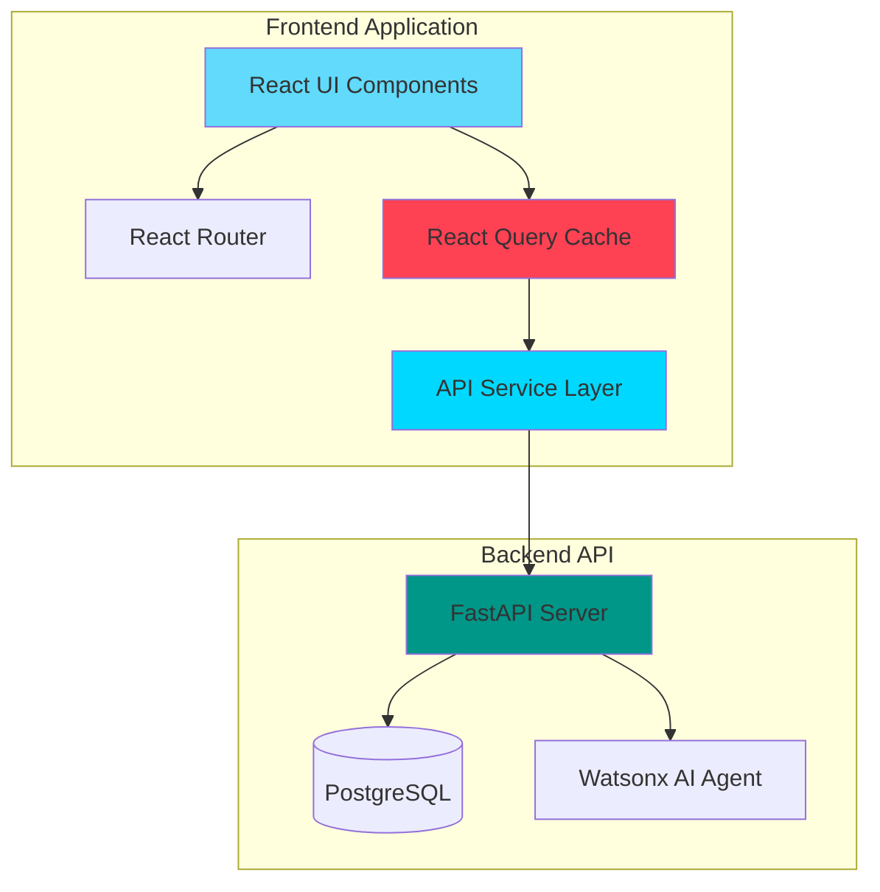

## Component Hierarchy

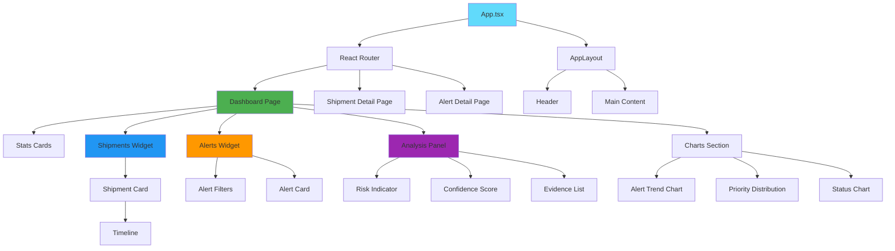

## Data Flow

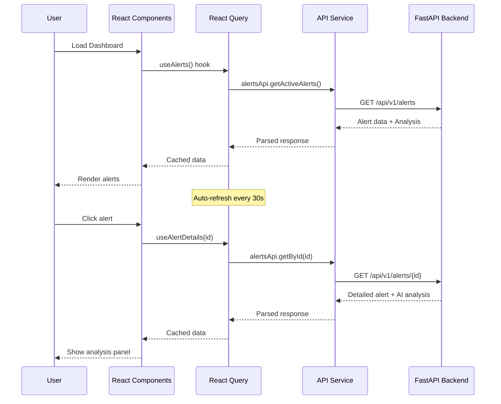

## State Management

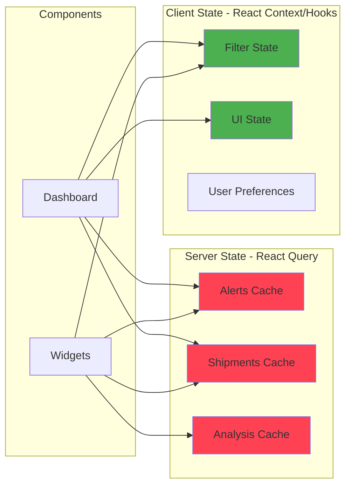

## API Integration Pattern

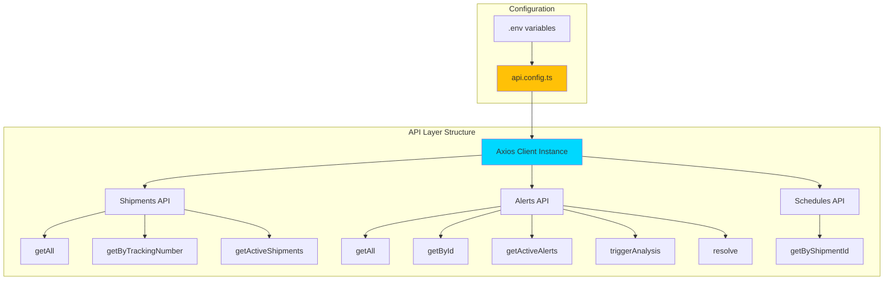

## Component Communication

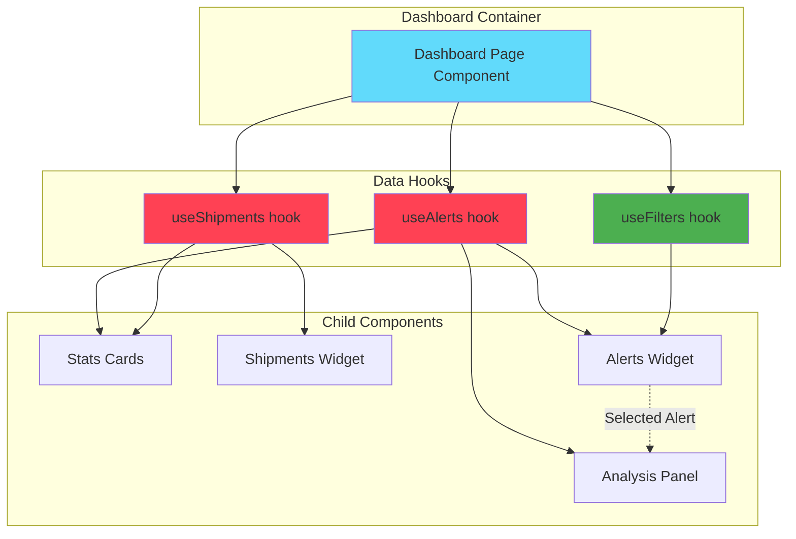

## Error Handling Flow

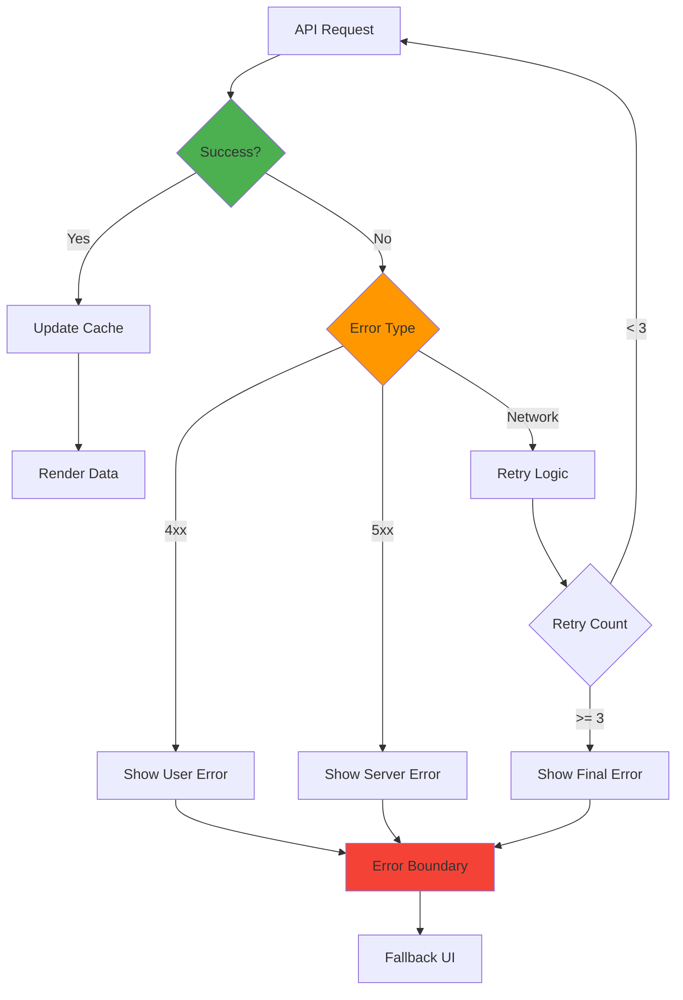

## Responsive Layout Strategy

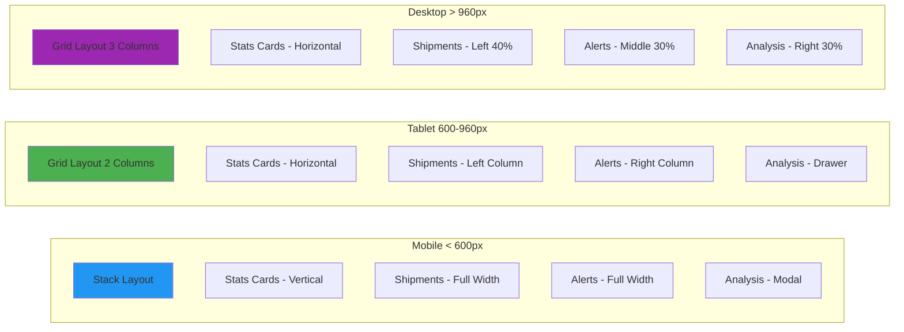

## Performance Optimization Strategy

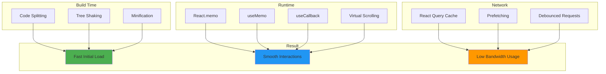

## Deployment Architecture

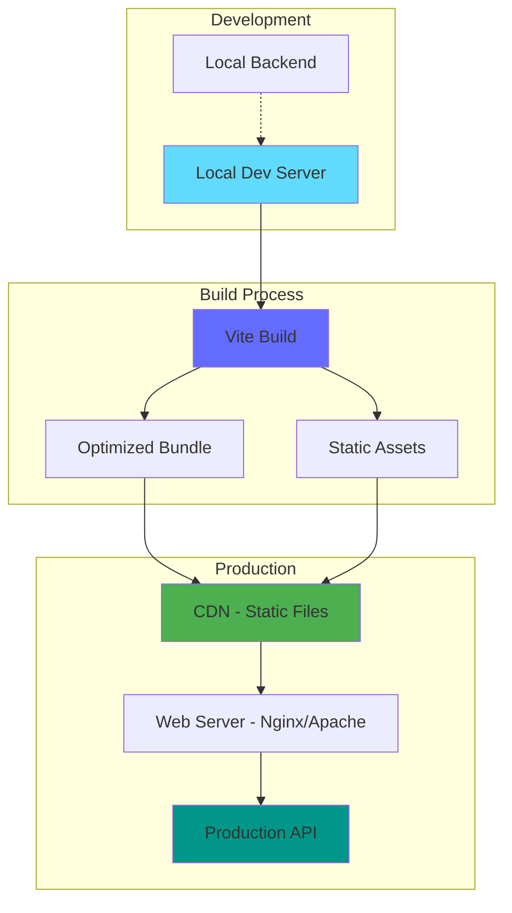

## Key Design Decisions

### 1. React Query for Server State
- **Why**: Automatic caching, background refetching, optimistic updates
- **Alternative**: Redux Toolkit Query, SWR
- **Trade-off**: Learning curve vs powerful features

### 2. Material-UI for Components
- **Why**: Comprehensive component library, good TypeScript support, customizable
- **Alternative**: Ant Design, Chakra UI, Custom components
- **Trade-off**: Bundle size vs development speed

### 3. Vite for Build Tool
- **Why**: Fast HMR, modern ESM-based, optimized builds
- **Alternative**: Create React App, Webpack
- **Trade-off**: Newer tool vs proven stability

### 4. TypeScript for Type Safety
- **Why**: Catch errors early, better IDE support, self-documenting
- **Alternative**: JavaScript with JSDoc
- **Trade-off**: Initial setup time vs long-term maintainability

### 5. Polling vs WebSocket
- **Current**: Polling every 30 seconds
- **Future**: WebSocket for real-time updates
- **Reason**: Simpler implementation, sufficient for MVP

## Security Considerations

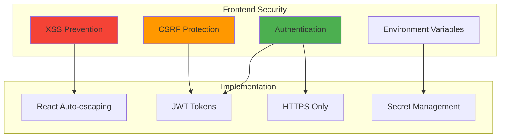

## Monitoring & Analytics

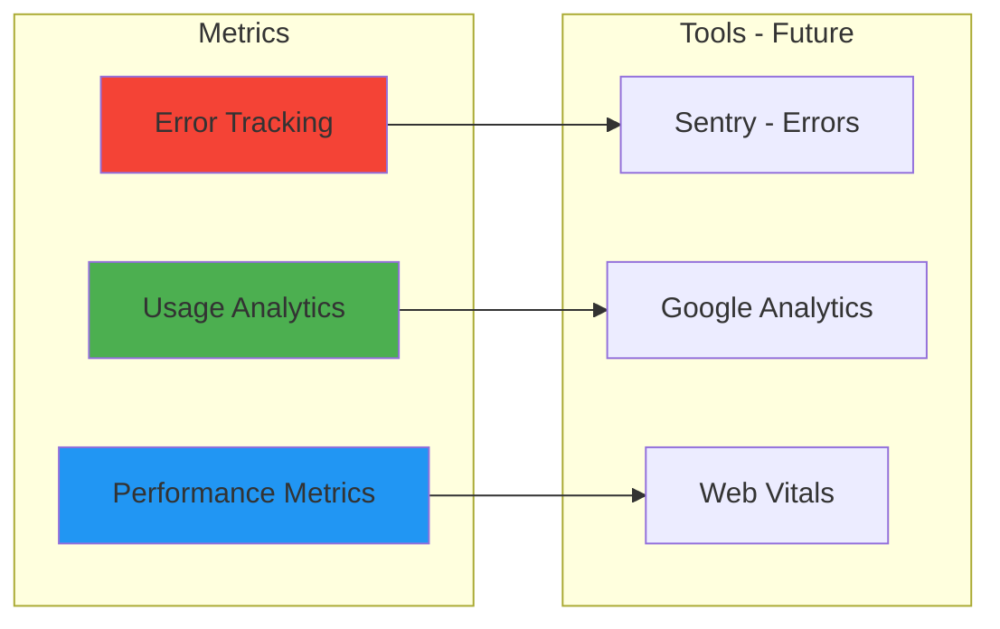

---

## Implementation Phases

### Phase 1: Foundation (Week 1)
- Project setup with Vite + TypeScript
- API client configuration
- Basic routing structure
- Core type definitions

### Phase 2: Core Features (Week 2)
- Dashboard layout
- Shipments widget
- Alerts widget
- Basic data fetching

### Phase 3: Advanced Features (Week 3)
- AI analysis panel
- Charts and visualizations
- Filtering and sorting
- Auto-refresh

### Phase 4: Polish (Week 4)
- Error handling
- Loading states
- Responsive design
- Performance optimization

### Phase 5: Testing & Documentation
- Unit tests
- Integration tests
- Documentation
- Deployment guide

---

## Success Metrics

| Metric | Target | Measurement |
|--------|--------|-------------|
| Initial Load Time | < 2 seconds | Lighthouse |
| Time to Interactive | < 3 seconds | Lighthouse |
| Bundle Size | < 500KB gzipped | Webpack Bundle Analyzer |
| API Response Time | < 500ms | Network tab |
| Error Rate | < 1% | Error tracking |
| User Satisfaction | > 4/5 | User feedback |
